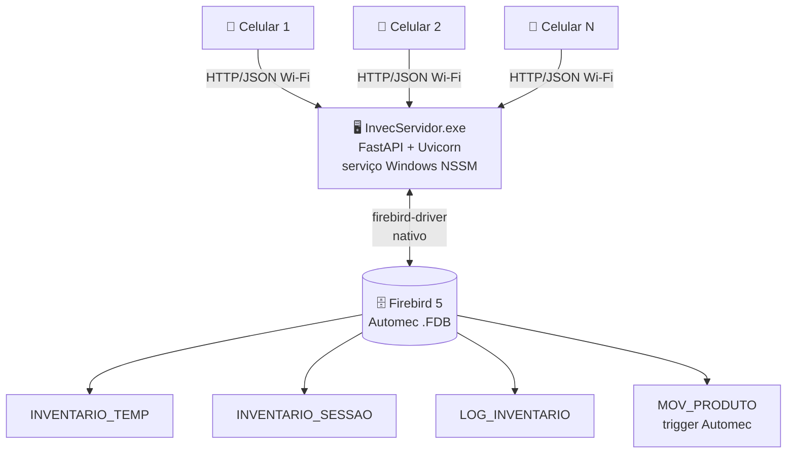
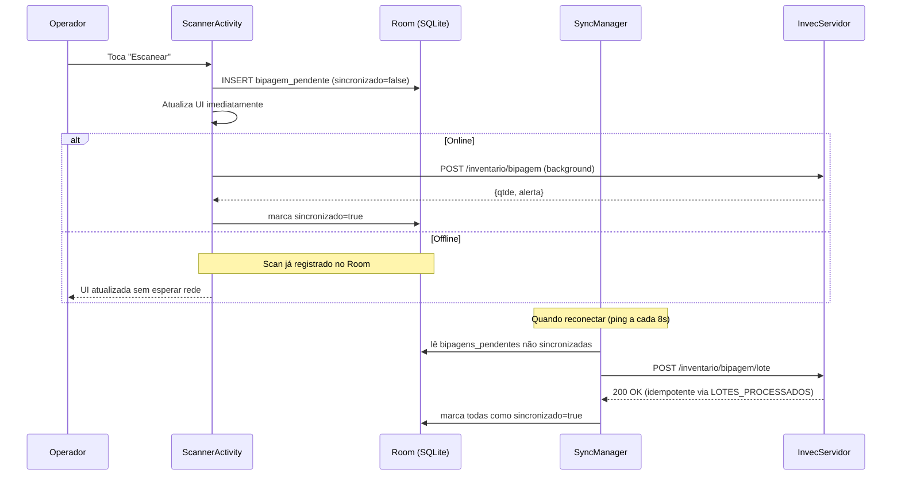
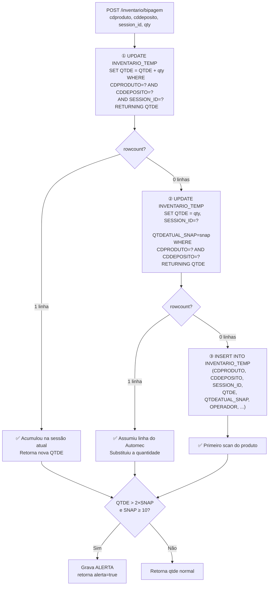
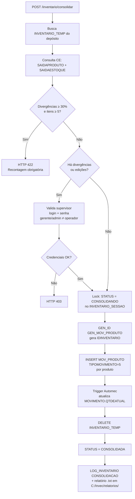

# Documentação Técnica — Invec

Arquitetura, segurança, banco de dados e endpoints do sistema Invec.

---

## Visão Geral

O Invec é um sistema cliente-servidor composto por dois componentes:

- **Backend FastAPI** (Python) — roda como serviço Windows e acessa o Firebird do Automec
- **App Android** (Kotlin) — comunica com o backend via HTTP/JSON pelo Wi-Fi interno

```
[Celulares Android]  <-- HTTP/JSON / Wi-Fi -->  [InvecServidor.exe]
                                                        |
                                              [Firebird 5 / Automec]
```



- Vários celulares operam simultaneamente no mesmo depósito
- Servidor registrado como serviço Windows (`InvecAPI` via NSSM) — inicia com o Windows
- Toda comunicação é autenticada via JWT Bearer token no header `Authorization`
- Escritas no banco usam `UPDATE ... RETURNING` atômico para evitar race conditions

---

## Stack Tecnológica

| Camada | Tecnologia | Versão |
|---|---|---|
| Backend linguagem | Python | 3.13 |
| Backend framework | FastAPI + Uvicorn | FastAPI 0.115+, Uvicorn ASGI |
| Banco de dados | Firebird 5 via `firebird-driver` | Driver nativo Python, sem ODBC |
| Distribuição servidor | PyInstaller + NSSM | Single-file EXE + serviço Windows |
| App linguagem | Kotlin | JVM target 17 |
| App SDK mínimo | Android 8.0 (API 26) | Target API 35 |
| HTTP client app | Retrofit2 + OkHttp3 | Retrofit 2.11, OkHttp 4.x |
| Câmera / barcode | CameraX + ML Kit Barcode | CameraX 1.3+, ML Kit offline |
| UI app | Material Design 3 + ViewBinding | Material 1.12+ |
| Autenticação | JWT HS256 (sessão) | python-jose 3.3+ |
| Licença | JWT RS256 / RSA 2048-bit | cryptography 41+ |
| Validação dados | Pydantic v2 | via FastAPI |

---

## Estrutura do Repositório (Monorepo)

```
inventario-app/
  api/                          # backend Python
    main.py                     # FastAPI app + lifespan (licença + migrations)
    server.py                   # entrypoint Uvicorn para PyInstaller
    instalador.py               # GUI Tkinter do instalador Windows
    servidor.spec               # PyInstaller spec do servidor
    instalador.spec             # PyInstaller spec do instalador
    requirements.txt
    app/
      database.py               # get_connection() context manager Firebird
      security.py               # JWT HS256, get_current_user(), roles
      licenca.py                # validação RSA 2048-bit (chave pública embutida)
      migrations.py             # DDL idempotente executado no startup
      models/schemas.py         # modelos Pydantic (request + response)
      routers/
        auth.py                 # login, rate limit, usuários mobile
        depositos.py            # listagem de depósitos
        produtos.py             # busca por código de barras / descrição
        inventario.py           # bipagem, relatório, consolidação, auditoria
        operadores.py           # CRUD de operadores físicos
  app/                          # Android Kotlin
    src/main/java/br/com/inventario/
      ui/base/TimeoutActivity.kt
      ui/login/LoginActivity.kt
      ui/main/MainActivity.kt
      ui/scanner/ScannerActivity.kt
      ui/relatorio/RelatorioActivity.kt
      ui/recontagem/RecontagemActivity.kt
      ui/historico/HistoricoActivity.kt
      ui/auditoria/AuditoriaActivity.kt
      ui/operadores/OperadoresActivity.kt
      ui/usuarios/UsuariosActivity.kt
      data/api/ApiService.kt        # interface Retrofit com todos os endpoints
      data/api/RetrofitClient.kt    # OkHttp + interceptor Bearer + interceptor 401
      data/model/Models.kt          # data classes request/response
      util/SessionManager.kt        # SharedPreferences (token, URL, depósito, etc.)
  docs/                         # documentação
  README.md
```

---

## Autenticação e Controle de Sessão

### Login e JWT

`POST /auth/login` recebe `login` e `senha`. O backend autentica em ordem:
1. Compara com `SENHAMOBILE` (hash bcrypt, coluna adicionada pelo Invec)
2. Se não existir, tenta `SENHA` (senha original do Automec — fallback de compatibilidade)

Em caso de sucesso retorna um JWT HS256 assinado com `JWT_SECRET` (definido no `.env`).

**Payload do token:**
```json
{
  "sub": "123",
  "login": "joao",
  "role": "operador",
  "idgrupo": 3,
  "mobile_admin": false,
  "exp": 1718000000
}
```

### Rate Limiting

Implementado com dicionários em memória (sem Redis). Dois contadores independentes: por IP e por login.  
**5 falhas em 60 segundos → bloqueio de 300 segundos.** Não persiste entre reinicializações do servidor.

### Inatividade — TimeoutActivity

Todas as Activities herdam de `TimeoutActivity`. Um `Handler + Runnable` dispara após 15 minutos.  
Qualquer toque na tela (`onUserInteraction`) reinicia o timer. Ao expirar, limpa a sessão e redireciona para `LoginActivity` com `FLAG_ACTIVITY_CLEAR_TASK`.

### Interceptor 401

`RetrofitClient` configura um `Interceptor` OkHttp que monitora todas as respostas. Se receber HTTP 401, limpa a sessão no `SessionManager` e redireciona para `LoginActivity`. Os dados de bipagem ficam preservados no servidor.

### SessionManager — SharedPreferences

| Chave | Conteúdo |
|---|---|
| `auth_token` | JWT Bearer token da sessão atual |
| `server_url` | URL base do servidor (ex: `http://192.168.1.31:8000/`) |
| `deposito_id` | Código do depósito selecionado |
| `deposito_nome` | Nome do depósito para exibição |
| `device_id` | UUID gerado na primeira instalação — identifica o dispositivo nos logs |
| `usuario_login` | Login do usuário logado |
| `usuario_role` | Role do usuário (`operador`/`gerente`/`admin`) |
| `mobile_admin` | Flag se o usuário tem admin mobile |
| `dark_mode` | `Boolean` — modo escuro ativo ou não |
| `session_id` | UUID da sessão de contagem atual (por depósito) |

### Modo Escuro

Switch na tela inicial (`MainActivity`). Preferência salva em `SessionManager.dark_mode`. `InvecApp.kt` (subclasse de `Application`) aplica o modo no startup, antes de qualquer Activity inflar layout:

```kotlin
// InvecApp.kt
val darkMode = SessionManager(this).isDarkMode()
AppCompatDelegate.setDefaultNightMode(
    if (darkMode) AppCompatDelegate.MODE_NIGHT_YES
    else          AppCompatDelegate.MODE_NIGHT_NO
)
```

Paleta de cores em `res/values-night/colors.xml`:

| Atributo | Modo claro | Modo escuro |
|---|---|---|
| `colorPrimary` | `#1565C0` | `#90CAF9` |
| `colorPrimaryText` | `#212121` | `#E0E0E0` |
| fundo de card | `#FFFFFF` | `#1E1E1E` |

> **Atenção**: sempre use `@color/colorPrimaryText` (não `#212121` hardcoded) em itens de lista — a variante night garante legibilidade no tema escuro.

---

## Roles e Permissões

| Role | IDGRUPO Automec | Permissões no Invec |
|---|---|---|
| `admin` | 1 | Tudo: bipar, relatório, editar, remover, consolidar com auto-autorização, auditoria, operadores |
| `gerente` | 2 | Igual ao admin, exceto gestão de usuários mobile (se não for `mobile_admin`) |
| `operador` | 3 | Bipar e ver relatório. Consolidar com divergências exige autorização de gerente/admin diferente |
| `mobile_admin` | qualquer | Flag adicional. Gerencia senhas mobile e delega admin mobile a outros usuários |

---

## Sistema de Licença RSA

A licença usa criptografia assimétrica **RSA 2048-bit / JWT RS256**.

| Artefato | Localização | Distribuir ao cliente? |
|---|---|---|
| `licenca_privada.pem` | `C:\Administracao\inventario-api\` | **NÃO — nunca** |
| `gerar_licenca.py` | `C:\Administracao\inventario-api\` | **NÃO — nunca** |
| Chave pública (embutida) | Dentro do `InvecServidor.exe` compilado | Sim (implicitamente) |
| `LICENSE_KEY` (JWT) | `C:\Invec\.env` no servidor do cliente | Sim — via instalador |

**Payload da licença:**
```json
{
  "produto":    "Invec",
  "cliente":    "Nome da Empresa Ltda",
  "cnpj":       "00.000.000/0001-00",
  "emitida_em": "2026-06-19",
  "expira_em":  ""
}
```

> `expira_em` vazio = licença permanente.

Validação no startup: `main.py` chama `validar_licenca()` no `lifespan` antes de aceitar qualquer requisição. Se inválida ou expirada, `sys.exit(1)` encerra o processo.

**Gerar licença para novo cliente:**
```bash
cd C:\Administracao\inventario-api
python gerar_licenca.py
# Preenche: nome do cliente, CNPJ, validade em meses (Enter = permanente)
# Saída: LICENSE_KEY=eyJhbGciOiJSUzI1NiJ9...
```

---

## Banco de Dados Firebird

### Tabelas do Automec utilizadas

| Tabela | Operação | Observação |
|---|---|---|
| `USUARIOS` | SELECT, UPDATE | Colunas `SENHAMOBILE` e `MOBILE_ADMIN` adicionadas pelo Invec |
| `DEPOSITO` | SELECT | Listagem de depósitos para seleção no app |
| `PRODUTO` | SELECT | Descrição, unidade e código do produto |
| `PRODUTO_CODBARRA` | SELECT | Códigos de barras alternativos (JOIN com PRODUTO) |
| `MOVIMENTO` | SELECT | `QTDEATUAL`: quantidade em estoque por produto e depósito |
| `MOV_PRODUTO` | INSERT, SELECT | Consolidação grava com `TIPOMOVIMENTO=5`. Trigger do Automec atualiza `MOVIMENTO.QTDEATUAL`. |
| `SAIDAPRODUTO` | SELECT | Pedidos de saída pendentes para CE (Considerar Entrega) |
| `SAIDAESTOQUE` | SELECT | Detalhe dos itens dos pedidos de saída |
| `PRODUTOPRECO` | SELECT | `FATORCONV` e `VLCUSTO` para calcular `QTENTRADA/QTSAIDA` no `MOV_PRODUTO` |

### Tabelas criadas pelo Invec

| Tabela / Coluna | Definição e propósito |
|---|---|
| `INVENTARIO_TEMP` | Bipagens em andamento. Colunas: `CDDEPOSITO`, `CDPRODUTO`, `PRODUTO`, `QTDE`, `QTDEATUAL_SNAP` (snapshot no 1º scan), `OPERADOR`, `SESSION_ID` (UUID do dispositivo), `DATA_HORA`. |
| `INVENTARIO_SESSAO` | Sessões por dispositivo. Colunas: `SESSION_ID` (PK), `CDDEPOSITO`, `OPERADOR`, `USUARIO`, `STATUS` (`ABERTA`/`CONSOLIDANDO`/`CONSOLIDADA`), `INICIO`, `FIM`. |
| `LOTES_PROCESSADOS` | Idempotência do sync offline. Armazena `LOTE_ID` UUID dos lotes já processados — evita duplicar bipagens em retransmissões. |
| `OPERADORES_APP` | Cadastro de operadores físicos. Colunas: `ID` (autoincrement), `NOME`, `ATIVO`. |
| `LOG_INVENTARIO` | Auditoria completa. Colunas: `ID`, `TIPO`, `CDDEPOSITO`, `CDPRODUTO`, `PRODUTO`, `OPERADOR`, `LOGIN_USUARIO`, `QTDE_ANTES`, `QTDE_DEPOIS`, `MOTIVO`, `DEVICE_ID`, `SESSION_ID`, `DATA_HORA (TIMESTAMP)`. |
| `USUARIO_DEPOSITO` | Restrição de acesso por depósito. Colunas: `IDUSUARIO`, `CDDEPOSITO` (PK composta). |
| `USUARIOS.SENHAMOBILE` | Hash bcrypt da senha mobile. `NULL` = usuário sem acesso ao app. |
| `USUARIOS.MOBILE_ADMIN` | `SMALLINT` — flag de administração mobile (`1`=ativo). |

---

## Modo Offline-First

O app suporta operação sem conexão contínua com o servidor.

### Conectividade — ServerMonitor

`util/ServerMonitor.kt` pinga `GET /ping` a cada **8 segundos**. Expõe `StateFlow<Boolean> isOnline` observado por todas as Activities. Chip "● Online" / "● Offline" no topo do Relatório muda em tempo real.

### Scan offline



1. Usuário escaneia produto
2. App grava imediatamente no Room (sem aguardar rede)
3. Se online: POST ao servidor em coroutine de background
4. Se offline: scan registrado localmente; UI atualizada sem travamento
5. `QTDEATUAL_SNAP` é capturado no 1º scan do produto (servidor ou cache local)
6. Relatório offline: construído a partir das `bipagens_pendentes` no Room

### Sincronização — SyncManager

Quando o dispositivo fica online, `SyncManager.sincronizarPendentes()` é chamado:
1. Lê todas as bipagens não sincronizadas do Room
2. Agrupa por SESSION_ID e cdproduto (soma qtde)
3. Envia `POST /inventario/bipagem/lote` com UUID de lote único
4. Servidor verifica idempotência via `LOTES_PROCESSADOS` e processa
5. Marca bipagens como sincronizadas no Room

**Race condition prevenida**: `SyncManager` usa `Mutex` com `withLock` — carregamento do relatório aguarda sync em vez de pular.

### Sessões por dispositivo

Cada celular gera um `SESSION_ID` UUID ao entrar em um depósito. Isso permite:
- Múltiplos coletores no mesmo depósito simultaneamente
- Rastreabilidade completa: cada MOV_PRODUTO no Automec identifica de qual dispositivo veio
- Consolidação independente por sessão

---

## Fluxo de Bipagem

`POST /inventario/bipagem` executa lógica em 3 passos para lidar com linhas pré-existentes do Automec:



- `QTDEATUAL_SNAP` é gravado apenas uma vez (no primeiro scan) e nunca alterado depois
- Se produto foi excluído e re-escaneado na mesma sessão (janela 12h): grava `ALERTA_REESCAN`

### Scanner Android — Modo Câmera (CameraX + ML Kit)

`ScannerActivity` usa `CameraX ImageAnalysis` com `BarcodeScanner` do ML Kit. Formatos suportados: EAN-13, EAN-8, Code 128, Code 39, QR Code, ITF, Codabar.

- **Modo simples**: câmera pausa após cada scan, reativa ao tocar em Escanear
- **Modo múltiplos** (switch ativo): câmera analisa continuamente com debounce de 1,5s por código

### Flash da Câmera

Botão raio na toolbar do `ScannerActivity` e `RecontagemActivity`. Toque alterna a lanterna da câmera traseira:

```kotlin
camera.cameraControl.enableTorch(flashLigado)
```

Estado não persiste entre sessões. Ícone: `res/drawable/ic_flash_on.xml` (vector Material Design). Menu: `res/menu/menu_scanner.xml`.

### EAN-13 vs UPC-A — Variações de Código de Barras

O scanner físico pode retornar 12 dígitos (UPC-A) enquanto o ERP gravou 13 (EAN-13 com zero à esquerda), ou vice-versa. O backend normaliza automaticamente:

```python
def _barcode_variants(codigo: str) -> list[str]:
    variantes = [codigo]
    if len(codigo) == 12:
        variantes.append("0" + codigo)   # UPC-A → EAN-13
    elif len(codigo) == 13 and codigo.startswith("0"):
        variantes.append(codigo[1:])      # EAN-13 → UPC-A
    return variantes
```

A query usa `WHERE CODBARRA IN (?, ?)` para encontrar qualquer variante em `PRODUTO_CODBARRA`.

### Scanner Android — Modo Bluetooth (HID Keyboard)

Leitores Bluetooth operam em modo HID (emulam teclado). O app usa um `EditText` invisível com `requestFocus()` para capturar o input. Um `TextWatcher` detecta o código completo (terminado com `\n`) e dispara o scan automaticamente.

---

## Fluxo de Consolidação



`POST /inventario/consolidar`:

1. Busca todos os itens de `INVENTARIO_TEMP` para o depósito
2. Consulta `SAIDAPRODUTO` + `SAIDAESTOQUE` para CE — envolvido em `try/except` para compatibilidade com versões antigas do Automec
3. Calcula divergências: item diverge se `|qtde_contada − (qtdeatual + qtdeentrega)| > 0`
4. Se `divergências ≥ 30%` e `total_itens ≥ 5` → retorna HTTP 422 "Recontagem obrigatória"
5. Se há divergências → valida credenciais do supervisor (gerente/admin, diferente do operador)
6. Lock no banco: atualiza `INVENTARIO_SESSAO.STATUS = 'CONSOLIDANDO'` — impede double-submit mesmo com reinicialização do servidor
7. Gera `IDINVENTARIO` via `GEN_ID(GEN_MOV_PRODUTO, 1)`
8. Para cada item: `INSERT` em `MOV_PRODUTO` com `TIPOMOVIMENTO=5` — trigger do Automec atualiza `MOVIMENTO.QTDEATUAL`
9. `DELETE FROM INVENTARIO_TEMP` para o depósito na mesma transação
10. Grava `CONSOLIDACAO` no `LOG_INVENTARIO` e salva relatório `.txt` em `C:\Invec\relatorios\`

---

## Considerar Entrega (CE)

Pedidos faturados mas não entregues representam estoque fisicamente presente mas já comprometido. O Invec considera isso no cálculo de divergências e na geração do `MOV_PRODUTO`:

| Cenário | QTENTRADA | QTSAIDA | VL_PERDA_GANHO |
|---|---|---|---|
| Com entrega e contado > atual | contado − atual | qtdeentrega | NULL (Automec calcula) |
| Com entrega e contado < atual | 0 | (atual − contado) + qtdeentrega | NULL |
| Com entrega e contado = atual | 0 | qtdeentrega | NULL |
| Sem entrega e contado > atual | contado − atual | 0 | (contado − atual) × vlcusto |
| Sem entrega e contado < atual | 0 | atual − contado | (contado − atual) × vlcusto (negativo) |
| Sem entrega e contado = atual | 0 | 0 | 0 |

> `vlcusto` vem de `PRODUTOPRECO.VLCUSTO / PRODUTOPRECO.FATORCONV`.

---

## Segurança e Auditoria

| Mecanismo | Implementação |
|---|---|
| Rate limit | 5 falhas em 60s → bloqueio 300s. Dicts em memória por IP e por login. Persistido em `LOG_INVENTARIO` (tipo `LOGIN_FALHOU`) — sobrevive a reinicializações. Limpo ao fazer login com sucesso. |
| JWT_SECRET | String aleatória mínimo 32 caracteres no `.env`. Assina todos os tokens HS256. |
| Supervisor obrigatório | Consolidação com divergências exige login/senha de gerente/admin diferente do operador via endpoint interno. |
| `EDICAO_SUSPEITA` | Detectada quando `qtde_nova == qtdeatual_snap` (contagem passou a coincidir exatamente com o estoque do sistema). |
| `ALERTA_REESCAN` | Produto com `EXCLUSAO` no log nas últimas 12h re-escaneado pelo mesmo `device_id`. |
| `ALERTA` de quantidade | `qtde > 2 × qtdeatual_snap` e `qtdeatual_snap ≥ 10`: grava alerta e retorna flag para o app. |
| `device_id` | UUID v4 gerado na primeira abertura do app, salvo em SharedPreferences. Gravado em todos os eventos do log. |
| Retenção de logs | `BIPAGEM`: 90 dias. Geral: 365 dias. `EDICAO_SUSPEITA` e `ALERTA_REESCAN`: permanentes. |

---

## Endpoints da API

| Método | Rota | Descrição | Acesso mínimo |
|---|---|---|---|
| POST | `/auth/login` | Autenticação com rate limit. Retorna JWT. | Público |
| GET | `/auth/usuarios` | Lista usuários do Automec com flags mobile. | `mobile_admin` |
| PUT | `/auth/usuarios/{id}/senha-mobile` | Define/altera senha mobile (hash bcrypt). | `mobile_admin` |
| PUT | `/auth/usuarios/{id}/toggle-admin` | Ativa/desativa `mobile_admin`. Só usuário MI. | Usuário MI |
| GET | `/depositos` | Lista depósitos do Automec. | Autenticado |
| GET | `/produtos/barcode/{codigo}` | Busca por código de barras. | Autenticado |
| GET | `/produtos/busca?q=` | Busca por descrição parcial. | Autenticado |
| GET | `/ping` | Health check sem auth. | Público |
| POST | `/sessao/iniciar` | Cria sessão em `INVENTARIO_SESSAO` (idempotente). | Autenticado |
| POST | `/inventario/bipagem` | Registra scan atômico. Retorna qtde e flag alerta. | Autenticado |
| POST | `/inventario/bipagem/lote` | Sincroniza lote offline (idempotente via `LOTES_PROCESSADOS`). | Autenticado |
| GET | `/inventario/relatorio/{dep}` | Lista itens de `INVENTARIO_TEMP` filtrado por session_id. | Autenticado |
| GET | `/inventario/resumo/{dep}` | Produtos com estoque > 0 ainda não bipados. | Autenticado |
| PUT | `/inventario/bipagem/{id}` | Edita quantidade. Grava `EDICAO` ou `EDICAO_SUSPEITA`. | Autenticado |
| DELETE | `/inventario/bipagem/{id}` | Remove item. Grava `EXCLUSAO` no log. | Autenticado |
| POST | `/inventario/consolidar` | Consolida no Automec com validação completa. | Autenticado |
| GET | `/inventario/historico/{dep}` | Consolidações anteriores com timestamp real de LOG_INVENTARIO. | Autenticado |
| GET | `/inventario/log/{dep}` | Log de auditoria (`LOG_INVENTARIO`). Fallback role→idgrupo. | Gerente/Admin |
| GET | `/operadores` | Lista operadores em `OPERADORES_APP`. | Autenticado |
| POST | `/operadores` | Cria novo operador. | Gerente/Admin |
| PUT | `/operadores/{id}/toggle` | Ativa/desativa operador. | Gerente/Admin |

---

## Migrations Automáticas

Executadas no lifespan do FastAPI antes de aceitar requisições. Cada operação é idempotente.

- `CREATE TABLE INVENTARIO_TEMP` se não existir
- `ALTER TABLE INVENTARIO_TEMP ADD COLUMN OPERADOR` se não existir
- `ALTER TABLE INVENTARIO_TEMP ADD COLUMN QTDEATUAL_SNAP` se não existir
- `CREATE TABLE OPERADORES_APP` se não existir
- `ALTER TABLE USUARIOS ADD COLUMN SENHAMOBILE` se não existir
- `ALTER TABLE USUARIOS ADD COLUMN MOBILE_ADMIN CHAR(1) DEFAULT 'N'` se não existir
- `CREATE TABLE LOG_INVENTARIO` se não existir
- `CREATE INDEX` `IDX_LOG_INV_DEPOSITO`, `IDX_LOG_INV_DATA`, `IDX_INVTEMP_PROD_DEP`, `IDX_LOG_INV_TIPO`
- Remove logs expirados conforme política de retenção
- Remove relatórios `.txt` com mais de 180 dias

---

## Build e Distribuição

### Servidor Windows

```powershell
cd C:\Administracao\inventario-api

# Compilar o servidor
pyinstaller servidor.spec --clean --noconfirm
# -> dist/InvecServidor.exe (~21 MB)

# Compilar o instalador (bundla InvecServidor.exe + nssm.exe)
pyinstaller instalador.spec --clean --noconfirm
# -> dist/Instalar-Invec.exe (~32 MB) — este é o arquivo entregue ao cliente
```

### Gerar licença para novo cliente

```powershell
python gerar_licenca.py
# Preenche: nome, CNPJ, validade em meses (Enter = permanente)
# Saída: LICENSE_KEY=eyJhbGciOiJSUzI1NiJ9...
# Enviar esta string ao cliente para colar no campo do instalador
```

### App Android

```powershell
cd C:\Administracao\inventario-app
.\gradlew assembleRelease
# -> app/build/outputs/apk/release/app-release.apk
# APK assinado com R8/ProGuard (minificação + ofuscação)
# Keystore: app/release/invec-app.jks (não commitada no git)
```
