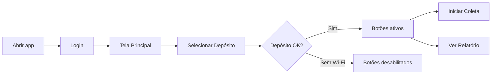
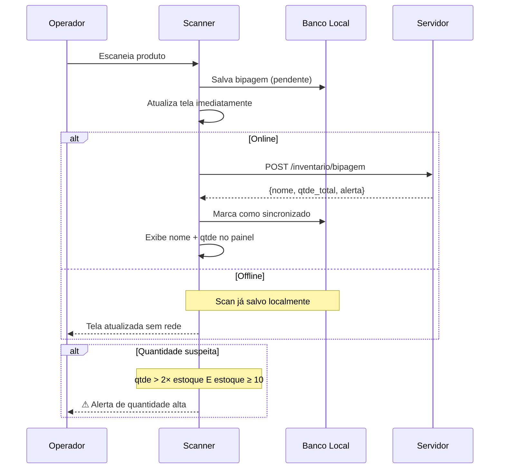
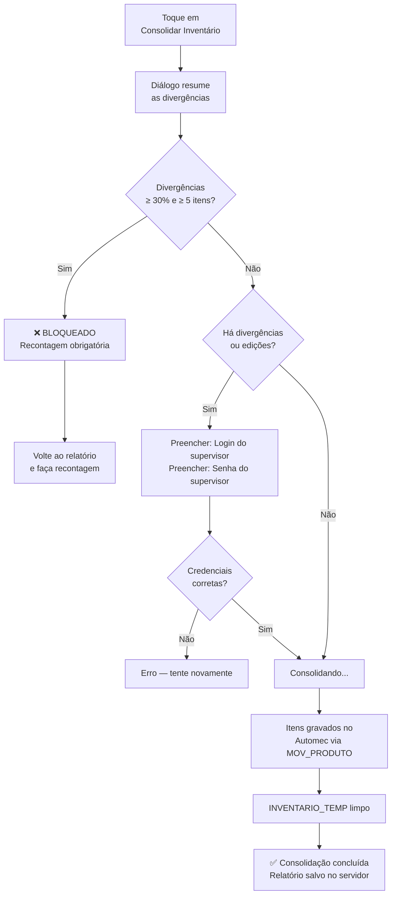
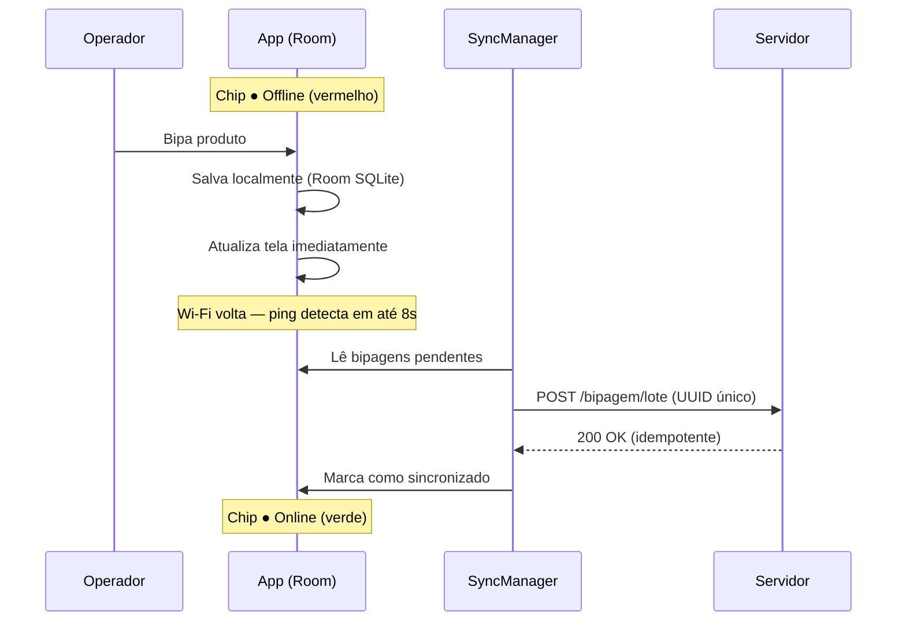
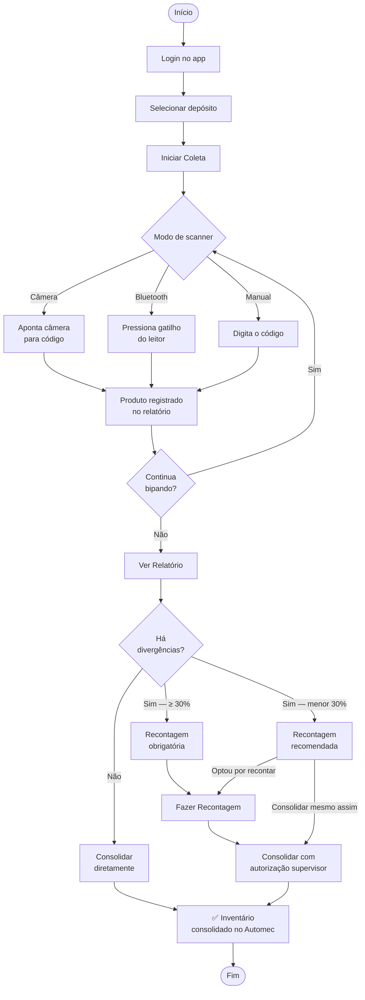

# Manual de Uso — App Invec

Guia completo para usar o aplicativo de inventário nos celulares Android — do primeiro acesso à consolidação no Automec.

---

## Índice

1. [Visão Geral](#1-visão-geral)
2. [Tela de Login](#2-tela-de-login)
3. [Tela Principal](#3-tela-principal)
4. [Tela de Scanner](#4-tela-de-scanner)
5. [Tela de Relatório](#5-tela-de-relatório)
6. [Recontagem](#6-recontagem)
7. [Consolidação](#7-consolidação)
8. [Histórico](#8-histórico)
9. [Auditoria](#9-auditoria)
10. [Modo Offline](#10-modo-offline)
11. [Gerenciar Operadores](#11-gerenciar-operadores)
12. [Gerenciar Usuários Mobile](#12-gerenciar-usuários-mobile)
13. [Fluxo Completo de Inventário](#13-fluxo-completo-de-inventário)

---

## 1. Visão Geral

O Invec é um aplicativo Android de coleta de inventário. Funciona em modo cliente-servidor: os celulares se comunicam com o `InvecServidor.exe` instalado no servidor da loja via Wi-Fi.

```
┌──────────────────────────────────────────────────────────────┐
│                        App Invec                             │
├─────────────────┬──────────────────────┬─────────────────────┤
│    SCANNER      │      RELATORIO       │   CONSOLIDACAO      │
│                 │                      │                     │
│ Camera + ML Kit │ Itens bipados        │ Grava no Automec    │
│ Bluetooth HID   │ Dif. de estoque      │ com autorizacao     │
│ Digitacao manual│ Editar / Remover     │ de supervisor       │
└─────────────────┴──────────────────────┴─────────────────────┘
```

**Roles disponíveis:**

| Role | Quem é | O que pode fazer |
|---|---|---|
| `operador` | Quem bipa | Scanner, relatório. Consolidar com divergências exige supervisor |
| `gerente` | Supervisor | Tudo do operador + autorizar consolidações + ver auditoria + gerenciar operadores |
| `admin` | Administrador | Tudo do gerente + auto-autorização na consolidação |
| `mobile_admin` | Flag adicional | Gerencia senhas e permissões mobile de outros usuários |

---

## 2. Tela de Login

### Layout da tela

```
┌─────────────────────────────────────┐
│                                     │
│        [Logo Pontual Tecnologia]    │
│          Inventário de Estoque      │
│                                     │
│  ┌───────────────────────────────┐  │
│  │  Login                        │  │  ← campo de texto
│  └───────────────────────────────┘  │
│  ┌───────────────────────────────┐  │
│  │  Senha                   [eye]│  │  ← mostra/oculta a senha
│  └───────────────────────────────┘  │
│                                     │
│  ┌───────────────────────────────┐  │
│  │            Entrar             │  │  ← botão laranja principal
│  └───────────────────────────────┘  │
│                                     │
│  ╔═══════════════════════════════╗  │
│  ║  CONFIGURAÇÃO DO SERVIDOR     ║  │  ← card com borda
│  ║  URL ________________________ ║  │
│  ║  [ Salvar servidor ]          ║  │
│  ╚═══════════════════════════════╝  │
└─────────────────────────────────────┘
```

### Elementos da tela

| Elemento | Função |
|---|---|
| **Login** | Campo para digitar o login do Automec |
| **Senha** | Campo de senha. Ícone 👁 alterna visibilidade |
| **Entrar** | Autentica e abre a tela principal |
| **URL do servidor** | Endereço IP + porta do InvecServidor (ex: `http://192.168.1.31:8000/`) |
| **Salvar servidor** | Grava a URL no celular — só precisa fazer uma vez por aparelho |

### Configuração inicial (primeira vez)

Na primeira vez que usar o app em um celular, preencha o campo **URL** antes de fazer login:

```
http://192.168.1.31:8000/
       ↑               ↑
    IP do servidor    porta padrão
```

> O endereço precisa ser configurado **uma vez por celular**. Se o IP do servidor mudar, volte aqui e atualize.

### Regras de acesso

| Situação | O que acontece |
|---|---|
| Credenciais corretas | Vai para a Tela Principal |
| Login ou senha errada | Mensagem de erro abaixo do botão. Tente novamente |
| **5 tentativas erradas em 60s** | Bloqueio automático por **5 minutos** |
| Sessão expirada (8h) | Redirecionado automaticamente para o login |
| **15 min sem usar o app** | Sessão encerrada por inatividade — faça login novamente |

> **Primeira senha:** o gerente ou admin mobile precisa cadastrar sua senha mobile antes do seu primeiro acesso. Sem senha mobile não é possível entrar no app.

---

## 3. Tela Principal

### Layout da tela

```
┌─────────────────────────────────────┐
│ [Logo Pontual branco]               │  ← cabeçalho laranja
│ Olá, [Nome do usuário]!             │
│ [Nome do depósito selecionado]      │
├─────────────────────────────────────┤
│                                     │
│  ┌── ⊞ Selecionar Depósito ──────┐  │  ← botão com borda
│  └───────────────────────────────┘  │
│                                     │
│  ╔════════════════════════════════╗ │
│  ║                                ║ │
│  ║      Iniciar Coleta            ║ │  ← botao laranja grande
│  ║                                ║ │     (desabilitado sem deposito)
│  ╚════════════════════════════════╝ │
│                                     │
│  ┌── Ver Relatorio ──────────────┐  │  ← botao com borda
│  └───────────────────────────────┘  │
│                                     │
│       Modo escuro          ◯        │  ← switch
│  [ Sair da conta ]  [ Servidor ]    │  ← rodapé
└─────────────────────────────────────┘
```

### Elementos da tela

| Elemento | Estado | Função |
|---|---|---|
| **Cabeçalho** | Sempre visível | Mostra nome do usuário logado e depósito ativo |
| **Selecionar Depósito** | Sempre ativo | Abre lista de depósitos — **obrigatório antes de coletar** |
| **Iniciar Coleta** | Ativo apenas após selecionar depósito | Abre o scanner para bipar produtos |
| **Ver Relatório** | Ativo apenas após selecionar depósito | Abre a lista de produtos já bipados |
| **Acesso Mobile — Usuários** | Visível só para `mobile_admin` | Gerencia senhas e permissões de usuários |
| **Modo escuro** | Switch | Alterna entre tema claro e escuro. Salvo automaticamente |
| **Sair da conta** | Rodapé | Encerra a sessão e volta para o login |
| **Servidor** | Rodapé | Abre o campo de URL para alterar o endereço do servidor |

### Sequência de uso



> **Atenção:** os botões **Iniciar Coleta** e **Ver Relatório** ficam **desabilitados** (cinza) até você selecionar um depósito. Selecione sempre antes de começar.

---

## 4. Tela de Scanner

### Layout da tela

```
┌─────────────────────────────────────┐
│ ← [Depósito]      [Bluetooth][flash]│  ← toolbar preta translúcida
├─────────────────────────────────────┤
│ ▓▓▓▓▓▓▓▓▓▓▓▓▓▓▓▓▓▓▓▓▓▓▓▓▓▓▓▓▓▓▓▓▓▓▓ │
│ ▓▓▓▓▓ ┌──────────────────────┐ ▓▓▓▓ │
│ ▓▓▓▓▓ │                      │ ▓▓▓▓ │  ← camera ao vivo
│ ▓▓▓▓▓ │  ─────────────────── │ ▓▓▓▓ │  ← linha guia laranja
│ ▓▓▓▓▓ │                      │ ▓▓▓▓ │
│ ▓▓▓▓▓ └──────────────────────┘ ▓▓▓▓ │  ← quadro de leitura
│ ▓▓▓   Pressione ESCANEAR...    ▓▓▓  │
│ ▓▓▓▓▓▓▓▓▓▓▓▓▓▓▓▓▓▓▓▓▓▓▓▓▓▓▓▓▓▓▓▓▓▓▓ │
├─────────────────────────────────────┤
│ ▌ Nome do último produto bipado     │  ← painel inferior preto
│   Qtde total: X           N scans   │
│ Múltiplas leituras seguidas    ◯    │
├─────────────────────────────────────┤
│  [ Escanear ]    [ Digitar código ] │
└─────────────────────────────────────┘
```

### Elementos da tela

| Elemento | Função |
|---|---|
| **← (seta voltar)** | Volta para a Tela Principal sem perder os scans |
| **[Bluetooth]** | Alterna entre modo câmera e modo Bluetooth (leitor físico) |
| **⚡ (flash)** | Liga/desliga a lanterna da câmera traseira |
| **Quadro branco** | Área de leitura — posicione o código de barras dentro dele |
| **Linha laranja** | Guia de alinhamento do código de barras |
| **Nome do produto** | Mostra o nome do último item bipado |
| **Qtde total / N scans** | Quantidade acumulada deste produto / total de bipagens na sessão |
| **Múltiplas leituras** | Switch: ativo = câmera lê continuamente sem precisar tocar em Escanear |
| **Escanear** | Ativa a câmera para uma leitura |
| **Digitar código** | Abre teclado para digitar o código manualmente |

### Modos de scanner

#### Modo Câmera (padrão)

```
┌── Câmera ativa ──────────────────┐
│  ▓▓▓ ┌────────────────────┐ ▓▓▓ │
│  ▓▓▓ │  CÓDIGO DE BARRAS  │ ▓▓▓ │  ← aponte o código para dentro
│  ▓▓▓ │ ─────────────────  │ ▓▓▓ │     do quadro branco
│  ▓▓▓ └────────────────────┘ ▓▓▓ │
└──────────────────────────────────┘
    [ Escanear ]                      ← toque para ativar a câmera
    Múltiplas leituras seguidas  ○   ← ative para leitura contínua
```

**Com switch "Múltiplas leituras" desligado (padrão):**
1. Toque em **Escanear**
2. Aponte a câmera para o código
3. Produto registrado → câmera pausa
4. Para o próximo produto, toque em **Escanear** novamente

**Com switch "Múltiplas leituras" ligado:**
1. A câmera fica contínua após o primeiro **Escanear**
2. Bipe um produto após o outro sem precisar tocar na tela
3. Um intervalo de 1,5 segundo evita leituras duplicadas do mesmo código

#### Modo Bluetooth

Toque em **[Bluetooth]** na toolbar para alternar. A câmera apaga e aparece:

```
┌──────────────────────────────────┐
│                                  │
│       [bt]  (icone Bluetooth)    │
│                                  │
│    Leitor Bluetooth ativo        │
│  Aponte o leitor para o código   │
│  de barras e pressione o         │
│  gatilho do leitor               │
│                                  │
└──────────────────────────────────┘
```

O leitor Bluetooth opera em modo HID (emula teclado). O app captura automaticamente o código assim que o gatilho é pressionado.

#### Digitar código manualmente

Use quando o código de barras estiver danificado ou ilegível:
1. Toque em **Digitar código**
2. Digite o código no teclado que aparece
3. Toque em **Buscar** — o produto é pesquisado e registrado

### O que acontece após cada scan



**Painel inferior após cada scan:**

| Campo | O que mostra |
|---|---|
| Nome | Nome completo do produto no Automec |
| Qtde total | Quantidade acumulada para este produto na sessão |
| N scans | Contador total de bipagens feitas na sessão |

### Alertas durante a bipagem

| Alerta | Quando aparece | O que fazer |
|---|---|---|
| **⚠ Quantidade alta** | Qtde contada > 2× estoque do sistema (e estoque ≥ 10) | Confirme se o valor está correto antes de continuar |
| **⚠ Catálogo não baixado** | Sem catálogo local e sem conexão ao selecionar depósito | Volte, conecte ao Wi-Fi e selecione o depósito novamente |
| **Produto não encontrado** | Código não existe no Automec | Tente digitar o código; verifique se é um produto cadastrado |

---

## 5. Tela de Relatório

### Layout da tela

```
┌─────────────────────────────────────┐
│ ← Relatório                         │  ← toolbar laranja
├─────────────────────────────────────┤
│ ● Online      12 itens      [⊙]     │  ← barra de status
│ ← Deslize p/ excluir · Toque editar │
├─────────────────────────────────────┤
│ PRODUTO A                           │
│ Sist: 10   Contada: 12   Dif: +2    │  ← diferença em verde
├─────────────────────────────────────┤
│ PRODUTO B                           │
│ Sist: 5    Contada: 4    Dif: -1    │  ← diferença em vermelho
├─────────────────────────────────────┤
│ PRODUTO C                           │
│ Sist: 8    Contada: 8    Dif:  0    │  ← diferença em cinza
├─────────────────────────────────────┤
│ ⚠ 5 produtos com estoque não foram  │  ← faixa vermelha
│   contados                          │
├─────────────────────────────────────┤
│ [ Histórico ]     [ Auditoria ]     │
│ [ ✓ Fazer Recontagem ]              │  ← verde
│ [ ↑ Sincronizar scans pendentes ]   │  ← só quando offline
│ [    Consolidar Inventário    ]     │  ← laranja
└─────────────────────────────────────┘
```

### Barra de status (topo da lista)

| Elemento | O que indica |
|---|---|
| **● Online** (verde) | App conectado ao servidor em tempo real |
| **● Offline** (vermelho) | Sem conexão — scans salvos localmente |
| **N itens** | Total de produtos diferentes bipados na sessão |
| **⊙ (loading)** | Sincronização em andamento |

### Colunas de cada item

| Coluna | Significado |
|---|---|
| **Sist** | Quantidade em estoque no Automec no momento do 1º scan do produto |
| **Contada** | Quantidade total bipada na sessão atual |
| **Dif** | Diferença: `Contada − Sist` |

**Cores da coluna Dif:**

| Cor | Valor | Interpretação |
|---|---|---|
| 🟢 Verde | Dif > 0 | Sobra — contou mais do que o sistema registra |
| 🔴 Vermelho | Dif < 0 | Falta — contou menos do que o sistema registra |
| ⚫ Cinza | Dif = 0 | Sem divergência |

### Gestos e interações na lista

| Gesto | O que faz |
|---|---|
| **Toque no item** | Abre diálogo para editar a quantidade |
| **Deslize para a esquerda** | Remove o item da contagem (pede confirmação e motivo) |
| **Deslize para a direita** | Remove o item da contagem (pede confirmação e motivo) |

### Editar quantidade

1. Toque no produto desejado
2. Digite a nova quantidade no campo exibido
3. Informe o **motivo** da alteração (obrigatório — fica gravado na auditoria)
4. Toque em **Salvar**

> Toda edição fica registrada no log de auditoria com usuário, device, data/hora e motivo.

### Remover item

1. Deslize o produto para a esquerda ou direita
2. Informe o motivo da remoção
3. Confirme a exclusão

### Botões da área de ações (parte inferior)

| Botão | Visibilidade | Função |
|---|---|---|
| **Histórico** | Sempre | Consolidações anteriores deste depósito |
| **Auditoria** | Apenas gerentes e admins | Log completo de operações |
| **✓ Fazer Recontagem** | Quando há itens | Abre a tela de recontagem |
| **↑ Sincronizar scans pendentes** | Offline + scans pendentes | Força sincronização com o servidor |
| **Consolidar Inventário** | Quando há itens | Confirma e grava no Automec |

### Aviso de produtos não contados

A faixa vermelha abaixo da lista aparece quando há produtos com **estoque positivo no Automec não bipados**. Indica quantos produtos estão nessa situação. Não impede a consolidação — apenas informa.

---

## 6. Recontagem

A recontagem permite fazer uma segunda contagem para confirmar divergências antes de consolidar.

### Layout da tela de recontagem

```
┌─────────────────────────────────────┐
│ ← Recontagem (2ª contagem)         │
├─────────────────────────────────────┤
│ ▓▓▓▓▓ ┌──────────────────────┐ ▓▓▓▓ │
│ ▓▓▓▓▓ │  ─────────────────── │ ▓▓▓▓ │  ← camera identica ao scanner
│ ▓▓▓▓▓ └──────────────────────┘ ▓▓▓▓ │
├─────────────────────────────────────┤
│ PRODUTO X   1a: 5   2a: ---         │  ← nao bipado na 2a vez
│ PRODUTO Y   1a: 3   2a:   3         │  ← igual, sem diferenca
│ PRODUTO Z   1a: 8   2a:   7         │  ← diferente, destacado
│                                     │
│  [ Escanear ]    [ Digitar codigo ] │
└─────────────────────────────────────┘
```

### Diálogo de resultado da recontagem

```
╔══════════════════════════════════════╗
║  Resultado da Recontagem             ║
║                                      ║
║  3 itens conferem entre 1ª e 2ª.    ║
║  2 itens ainda divergem.             ║
║                                      ║
╠══════════════════════════════════════╣
║  [ Consolidar agora ]                ║  ← azul — sem divergências
╠══════════════════════════════════════╣
║  [ Aplicar 2ª contagem (voltar) ]    ║  ← verde — com divergências
║  [ Manter 1ª contagem ]              ║  ← borda — descartar 2ª
║  [ Continuar recontando ]            ║  ← texto — fechar diálogo
╚══════════════════════════════════════╝
```

| Botão | Quando aparece | O que faz |
|---|---|---|
| **Consolidar agora** | Sem divergências entre 1ª e 2ª | Consolida diretamente sem voltar ao relatório |
| **Aplicar 2ª contagem** | Com divergências | Atualiza o relatório com os valores da 2ª contagem |
| **Manter 1ª contagem** | Com divergências | Descarta a 2ª contagem, volta ao relatório com os valores originais |
| **Continuar recontando** | Sempre | Fecha o diálogo e continua bipando |

---

## 7. Consolidação

A consolidação **grava os dados no Automec** (tabela `MOV_PRODUTO`). Esta operação não pode ser desfeita.

### Fluxo completo de consolidação



### Diálogo de consolidação

```
╔══════════════════════════════════════╗
║  Consolidar Inventário               ║
║                                      ║
║  12 itens bipados.                   ║
║  3 com divergência.                  ║
║  [Mensagem de orientação]            ║
║                                      ║
╠══════════════════════════════════════╣
║  [ Fazer Recontagem (Recomendado) ]  ║  ← verde — quando há divergências
╠══════════════════════════════════════╣
║  [ Consolidar agora ]                ║  ← laranja
║  [ Cancelar ]                        ║  ← texto
╚══════════════════════════════════════╝
```

### Cenários de consolidação

#### Sem divergências

1. Toque em **Consolidar Inventário**
2. Leia o resumo no diálogo
3. Toque em **Consolidar agora**
4. Aguarde a confirmação ✅

#### Com divergências — supervisor obrigatório

1. Toque em **Consolidar Inventário**
2. No diálogo, toque em **Consolidar agora**
3. Preencha o **login** e **senha mobile** de um gerente ou admin
4. Toque em **Autorizar e Consolidar**

> **Regra:** o supervisor precisa ser **diferente** do operador que fez a coleta. Gerentes e admins podem autorizar com as próprias credenciais.

#### Recontagem obrigatória — bloqueio automático

Se **mais de 30% dos itens** (mínimo 5 itens) tiverem divergência, o sistema **bloqueia** a consolidação e exige recontagem antes.

### Resumo das regras de consolidação

| Situação | O que é necessário |
|---|---|
| Sem nenhuma divergência, sem edições | Consolidar diretamente — nenhum supervisor |
| Com edições (mesmo sem divergência aparente) | Autorização de supervisor |
| Com divergências (< 30% dos itens) | Autorização de supervisor |
| Com divergências (≥ 30% e ≥ 5 itens) | **Recontagem obrigatória** antes de consolidar |

---

## 8. Histórico

Disponível no relatório, botão **Histórico**.

Mostra todas as consolidações já realizadas para o depósito selecionado:

| Campo | O que mostra |
|---|---|
| Produto | Nome e código do produto |
| Quantidade contada | Valor que foi consolidado |
| Quantidade do sistema | Valor que estava no Automec antes |
| Data | Data/hora da consolidação (via `LOG_INVENTARIO`) |

---

## 9. Auditoria

Disponível apenas para **gerentes e administradores**, botão **Auditoria** no relatório.

### Layout da tela

```
┌─────────────────────────────────────┐
│ ← Auditoria                        │
├─────────────────────────────────────┤
│ [EDICAO]   PRODUTO X                │
│  10→12  Joao   [dev-abc]    14:32   │
├─────────────────────────────────────┤
│ [EXCLUSAO]  PRODUTO Y               │
│   5→0  Maria   [dev-xyz]    15:01   │
├─────────────────────────────────────┤
│ [ALERTA]   PRODUTO Z                │
│  Sist:3  Conta:50  [...]    15:45   │
└─────────────────────────────────────┘
```

### Tipos de evento no log

| Tipo | O que aconteceu |
|---|---|
| `BIPAGEM` | Produto escaneado normalmente |
| `EDICAO` | Quantidade editada manualmente |
| `EDICAO_SUSPEITA` | Edição fez o valor coincidir exatamente com o estoque do sistema |
| `EXCLUSAO` | Item removido da contagem |
| `CONSOLIDACAO` | Inventário consolidado com sucesso |
| `ALERTA` | Quantidade bipada muito acima do estoque esperado |
| `ALERTA_REESCAN` | Produto excluído e re-escaneado na mesma sessão (últimas 12h) |
| `LOGIN_FALHOU` | Tentativa de login com credenciais inválidas |

Cada evento registra: usuário, operador, device ID, data/hora, quantidades antes e depois, e motivo.

---

## 10. Modo Offline

O app funciona **sem conexão com o servidor** durante a coleta.

### Diagrama do modo offline



### O que funciona offline

| Função | Offline | Online necessário |
|---|---|---|
| Bipar produtos com câmera | ✅ | — |
| Bipar com leitor Bluetooth | ✅ | — |
| Ver relatório parcial | ✅ | — |
| Pesquisar produto por código | ✅ (catálogo local) | — |
| Fazer login | ❌ | ✅ |
| Consolidar inventário | ❌ | ✅ |
| Ver histórico e auditoria | ❌ | ✅ |

### Chip de status de conexão

| Chip | Cor | Significado |
|---|---|---|
| `● Online` | Verde | Conectado. Dados sincronizados em tempo real |
| `● Offline` | Vermelho | Sem conexão. Scans salvos localmente |

O chip muda automaticamente. O ping é feito a cada **8 segundos**.

> Se o botão **↑ Sincronizar scans pendentes** aparecer, toque nele para forçar a sincronização antes de consolidar.

---

## 11. Gerenciar Operadores

Disponível para **gerentes e administradores**.

Operadores são as pessoas que fazem a coleta física. Eles aparecem na lista de seleção no início da bipagem e são gravados em todos os logs de auditoria.

### Ações disponíveis

| Ação | Como fazer |
|---|---|
| **Adicionar operador** | Toque em **"+"** no canto superior direito |
| **Desativar operador** | Toque em **"Desativar"** ao lado do nome |
| **Reativar operador** | Toque em **"Ativar"** ao lado do nome |

> Operadores desativados não aparecem na seleção durante a bipagem, mas o histórico deles permanece intacto.

---

## 12. Gerenciar Usuários Mobile

Disponível apenas para **admin mobile** — geralmente o usuário MI.

Na Tela Principal, toque em **"Acesso Mobile — Usuários"** (só aparece para admin mobile).

### O que é a senha mobile

Todo usuário do Automec que vai usar o app precisa de uma **senha mobile** — separada da senha do Automec. Sem ela, não é possível fazer login no app.

### Definir ou alterar senha mobile

1. Localize o usuário na lista
2. Toque em **"Definir senha"** ou **"Alterar senha"**
3. Digite a nova senha e confirme

### Admin mobile

| Ação | O que faz |
|---|---|
| **Dar admin mobile** | Usuário passa a poder gerenciar senhas de outros |
| **Remover admin mobile** | Revoga a permissão de administração mobile |

> Apenas o usuário MI pode dar/remover admin mobile de outros. Admins mobile normais não podem promover outros acima do próprio nível.

---

## 13. Fluxo Completo de Inventário



### Dicas gerais

| Dica | Por quê |
|---|---|
| Selecione o **operador correto** antes de começar | O operador trava após o 1º scan e não pode ser trocado sem reiniciar a sessão |
| **Nunca feche o app durante a consolidação** | Aguarde a confirmação ✅. O servidor tem proteção contra duplo envio, mas é mais seguro aguardar |
| **Em caso de travamento**, reabra o app normalmente | O servidor preserva todos os dados — continue de onde parou |
| Use **Múltiplas leituras** para agilizar a coleta em gôndolas grandes | Evita ficar tocando em Escanear a cada produto |
| **Confira o aviso de não contados** antes de consolidar | Produtos com estoque positivo não bipados podem indicar um corredor esquecido |
| Relatórios ficam em `C:\Invec\relatorios\` no servidor | Consulte o gerente se precisar de um histórico de consolidação anterior |

---

> **Versão do manual:** Junho/2026 — App Invec v1.x
